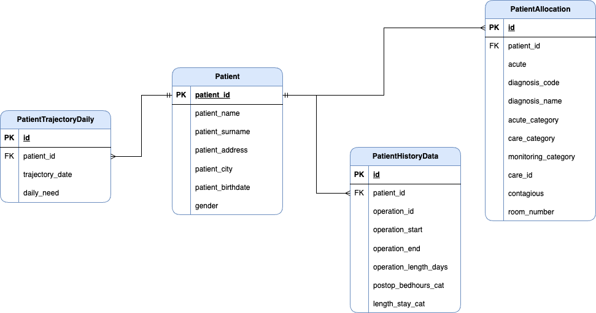

# Bedreflyt DT API

The Bedreflyt DT API is a RESTful API for healthcare resource allocation and simulation management. Built with Spring Boot and Kotlin, it provides comprehensive access to database operations, triplestore management, patient allocation, and room simulation capabilities using SMOL (Semantic Modeling Language) and constraint solving.

## Overview

This API manages hospital resources, patient allocations, and treatment simulations by integrating:
- **PostgreSQL Database**: Stores patient data, allocations, and trajectories
- **Apache Jena Fuseki Triplestore**: Manages semantic hospital data (rooms, wards, treatments)
- **Redis Cache**: Improves performance for frequently accessed data
- **External Solver**: Constraint optimization for room allocation (e.g., Z3 via FastAPI)
- **SMOL Engine**: Semantic modeling and reasoning

## Architecture

### Technology Stack
- **Language**: Kotlin with Java 21
- **Framework**: Spring Boot 3.4.2
- **Build Tool**: Gradle 8.x
- **Database**: PostgreSQL (primary) / SQLite (simulation)
- **Triplestore**: Apache Jena Fuseki
- **Cache**: Redis
- **API Documentation**: Swagger/OpenAPI (SpringDoc)
- **Security**: Spring Security with JWT

### Key Dependencies
- Spring Boot Data JPA & Redis
- Jackson for JSON processing
- Hibernate ORM 6.6.1
- SMOL Semantic Objects library
- JWT (io.jsonwebtoken) for authentication

## Running the API

### Prerequisites
1. Java 21 or later
2. PostgreSQL database
3. Apache Jena Fuseki triplestore
4. Redis server (optional, for caching)
5. Constraint solver service (optional, for allocation features)

### Environment Variables

#### Required Database Configuration
- `DB_URL`: Database connection URL (e.g., `jdbc:postgresql://localhost:5432/bedreflyt`)
- `DB_DRIVER`: Database driver class (default: `org.postgresql.Driver`)
- `DB_USER`: Database username
- `DB_PASSWORD`: Database password
- `DB_DIALECT`: Hibernate dialect (default: `org.hibernate.dialect.PostgreSQLDialect`)
- `DB_SCHEMA`: Database schema name

#### Triplestore Configuration
- `TRIPLESTORE_URL`: Fuseki server URL (default: `localhost`)
- `TRIPLESTORE_DATASET`: Dataset name in Fuseki (default: `Bedreflyt`)
- `DOMAIN_PREFIX_URI`: RDF domain prefix (default: `http://www.smolang.org/bedreflyt#`)
- `EXTRA_PREFIXES`: Additional RDF prefixes (default: `ast,http://www.smolang.org/bedreflyt#`)

#### SMOL Configuration
- `SMOL_PATH`: Semicolon-separated paths to SMOL files. Available files:
  - `Bedreflyt_data.smol`
  - `Bedreflyt_diagnosis.smol`
  - `Bedreflyt_rooms.smol`
  - `Bedreflyt_tasks.smol`
  - `Bedreflyt_treatments.smol`
  - `Bedreflyt_treatmentSteps.smol`
  - `Bedreflyt_wards.smol`
  - `Bedreflyt_hospitals.smol`
  - `Bedreflyt_floors.smol`
  - `Bedreflyt_corridors.smol`
  - `Bedreflyt_offices.smol`
  - `Bedreflyt_bathrooms.smol`
  - `Bedreflyt_cities.smol`
  - `Bedreflyt_monitoringCategories.smol`
  - `Bedreflyt.smol` (main file)

#### Optional Services
- `SOLVER_ENDPOINT`: Constraint solver API host (default: `localhost`, port: 8000)
- `LM_HOST`: Lifecycle manager host (default: `localhost`)
- `LM_PORT`: Lifecycle manager port (default: `8091`)

#### API Server Configuration
- `API_PORT`: Server port (default: `8090`)

#### Redis Cache Configuration (Optional)
- `CACHE_HOST`: Redis server host (default: `localhost`)
- `CACHE_PORT`: Redis server port (default: `6379`)
- `CACHE_DATABASE`: Redis database number (default: `0`)
- `CACHE_TIMEOUT`: Connection timeout in milliseconds (default: `2000`)

### Running with Docker

```bash
# Build the application
./gradlew build

# Build Docker image
docker build -t bedreflyt-api .

# Run with Docker
docker run -p 8090:8090 \
  -e DB_URL=jdbc:postgresql://host.docker.internal:5432/bedreflyt \
  -e DB_USER=postgres \
  -e DB_PASSWORD=yourpassword \
  -e DB_SCHEMA=public \
  -e TRIPLESTORE_URL=host.docker.internal \
  bedreflyt-api
```

### Running Locally

```bash
# Set environment variables
export DB_URL=jdbc:postgresql://localhost:5432/bedreflyt
export DB_USER=postgres
export DB_PASSWORD=yourpassword
export DB_SCHEMA=public

# Build and run
./gradlew bootRun
```

## API Documentation
- **Swagger UI**: `http://localhost:8090/swagger-ui.html`
- **OpenAPI Spec**: `http://localhost:8090/api-docs`

## Triplestore

The triplestore is an RDF database that stores semantic data in triples (subject-predicate-object). It manages hospital infrastructure data including rooms, wards, floors, treatments, and diagnostic information. The triplestore uses SPARQL for querying and supports inference through the OWL reasoner.

### Apache Jena Fuseki Setup

This project uses [Apache Jena Fuseki](https://jena.apache.org/download/) configured via the `config.ttl` file in the repository root.

#### Configuration Highlights
- **Dataset**: Bedreflyt
- **Reasoner**: OWL Full with Forward Chaining (OWLFBRuleReasoner)
- **Storage**: TDB2 (high-performance native RDF store)
- **Endpoints**: SPARQL query, update, and Graph Store Protocol

## Database Schema

The PostgreSQL database stores live operational data including patients, allocations, and treatment trajectories. The schema supports both real-time and simulated patient management.

### Key Entities
- **Patient**: Patient demographic and medical information
- **PatientAllocation**: Current room assignments and monitoring status
- **PatientTrajectory**: Historical and planned treatment paths
- **PatientHistoryData**: Audit trail of patient changes

### Entity Relationship Diagram



## Development

### Building the Project

```bash
# Build without tests
./gradlew build -x test

# Build with tests
./gradlew build

# Create executable JAR
./gradlew bootJar
```

The built JAR will be located at `build/libs/bedreflyt-api-<version>.jar`.

### Project Structure

```
src/main/kotlin/no/uio/bedreflyt/api/
├── Main.kt                      # Application entry point
├── config/                      # Spring configuration classes
├── controller/                  # REST API endpoints
│   ├── HomeController.kt        # Health check
│   ├── PatientController.kt     # Patient management
│   ├── AllocationController.kt  # Room allocation
│   ├── SimulationController.kt  # Simulation execution
│   └── triplestore/             # Triplestore CRUD operations
├── model/                       # Data models
│   ├── live/                    # Database entities
│   ├── simulation/              # Simulation models
│   └── triplestore/             # RDF models
├── repository/                  # JPA repositories
├── service/                     # Business logic
│   ├── live/                    # Patient & allocation services
│   ├── simulation/              # Simulation services
│   └── triplestore/             # Triplestore operations
├── types/                       # DTOs and request/response types
└── utils/                       # Helper utilities (Simulator, etc.)
```

### Testing

```bash
# Run all tests
./gradlew test

# Run specific test class
./gradlew test --tests "ClassName"
```

## Features

### Room Allocation
The system uses constraint solving to optimize patient-room assignments based on:
- Room capacity and monitoring capabilities
- Patient medical requirements and diagnosis
- Gender separation policies
- Infectious disease isolation requirements
- Room change minimization

### Simulation Modes
- **Real-time Mode**: Actual patient allocation with immediate database updates
- **Simulation Mode**: What-if analysis with temporary data and rollback capability
- **Global Optimization**: Multi-day planning with adaptive capacity management

### Performance Optimization
- Redis caching for frequently accessed triplestore queries
- Connection pooling (HikariCP) with optimized pool sizes
- Async request handling for long-running operations
- SQLite for isolated simulation environments
